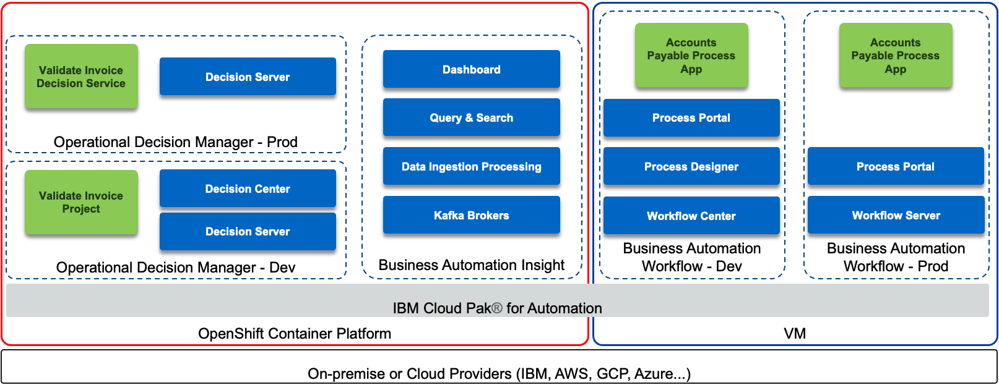

# Adapt business policies to changing conditions with decision services

Today, your accounts process is entirely manual, with the amount of invoices only increasing. When first capturing an invoice, you must enter the invoice data into multiple systems. From there, different people must validate the invoice data and match the invoice to the Purchase Order. This results in data entry errors and inconsistencies across multiple systems. After all these steps, you can finally process payment in the ERP system.
This use case demonstrates the use of automation to adapt business policies to changing conditions with business rules.
Are you ready to see flexible business decisions in action?

---------

## Accounts Payable Invoice Validation
**an IBM Cloud Pak for Business Automation entry point**

***

**Business Challenge:** Industries are being disrupted ... requiring rapid creation of new products and services

**Entry Point:** Adapt business policies to changing conditions with decision services

**Use Case Overview:** Today, your accounts process is entirely manual, with the amount of invoices only increasing. When first capturing an invoice, you must enter the invoice data into multiple systems. From there, different people must validate the invoice data and match the invoice to the Purchase Order. This results in data entry errors and inconsistencies across multiple systems. After all these steps, you can finally process payment in the ERP system. In this demo, you will learn how to adapt business policies to changing conditions with business rules.

**Trial Details:** If you have a Digital Business Automation on Cloud trial, your environment is predeployed, continue to the Guided Tour section within the [Accounts payable use case](https://ibm-cloud-architecture.github.io/refarch-dba/use-cases/accounts-pay/).  Don't have a trial yet? <a href="https://www.ibm.com/account/reg/us-en/signup?formid=urx-45706" target="_blank">Sign up</a> to get started.

**Technical Details:** To deploy Accounts Payable on your own environment and learn more about the technical architecture, read on!

### Architecture Diagram

The following diagram illustrates the products involved and the solution components:

 

### Environment

We assume the following products are installed, up and running:

* IBM Cloud Pak® for Automation version 20.0.3
    * Business Automation Workflow (BAW) on VMs (may work on OpenShift, has not been tested)
    * Operational Decision Manager (ODM) on OpenShift
    * Business Automation Insights (BAI) on OpenShift (Optional, can be run without)

### Deploy the artifacts

1. Determine your credentials
    1. For BAW, use your own credentials to login to Workflow Center and Process Portal
    1. For ODM, create a service credential/account or use your own basic auth credentials to login to Rule Execution Server console
    1. For BAI, set your password as required by your platform and login to Kibana
1. Deploy ODM artifacts
    1. Login to Decision Center Business console
    1. On Library, click the import icon
    1. Choose and upload Validate Invoice [main].zip
    1. Open the main branch, click Deployments and deploy to your Rule Execution Server (adjust the server within the deployment configuration as required)
1. (Optional) Deploy BAI artifacts
    1. Login to Kibana
    1. Management -> Saved Objects -> Import -> AccountsPayable - YYYY.MM.DD_XX.ndjson
1. Deploy BAW artifacts
    1. Login to Workflow Center and navigate to Process Apps
    1. Import Accounts_Payable - YYYY.MM.DD_XX.twx
    1. Open the Accounts Payable process app and navigate to Process App Settings -> Servers
    1. Edit the settings for hostname, port, authentication and so forth for your ODM server
    1. (Optional) Open the BAI Generators team and add an appropriate user to the team
    1. Go back to Workflow Center and create a new snapshot of the process application
    1. Install the new snapshot to your Workflow Server unless you wish to run directly on Workflow Center's playback server (to support the optional BAI events, make sure the BAW server running the process app has BAI emitters enabled)
1. (Optional) Setup BAI data
    1. Login to Process Portal with the user specified in the above BAI Generators team
    1. Under Launch, click Generate Week 1 BAI Data AP and wait for the spinner to complete in about 20 seconds
    1. Do the same for Generate Week 2 BAI Data AP
    1. Login to Kibana
    1. Management -> Index Patterns -> process-sum* -> refresh icon
    1. Open the Dashboard -> Accounts Payable (AP) - Week 1 and Week 2 and check that data is displayed.  If it is not, check your emitters are sending data and connected to the BAW server where the Process App is deployed.

## Contributors
  * Lead content developer [Jeff Goodhue](https://www.linkedin.com/in/jeffreygoodhue/)
